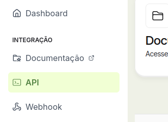
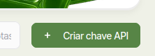
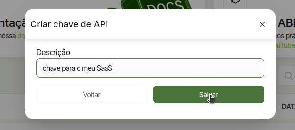
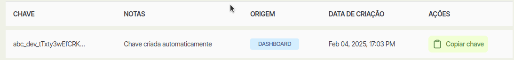

Siga os passos abaixo para gerar sua chave de API na **{{org_name}}**:

1. Crie sua conta na **{{org_name}}**. Você pode fazer isso [clicando aqui](https://www.abacatepay.com/login).

2. No menu lateral esquerdo, na seção **INTEGRAÇÃO**, clique em **API**. Se preferir, pode ir direto [por este link](https://www.abacatepay.com/integrar).

    

3. No canto superior direito da tela, clique no botão **Criar Chave de API**.

    

4. Um modal será aberto. Digite uma descrição para a chave (ex: `"chave para o meu SaaS"`) e clique em **Salvar**.

    

5. Pronto! Agora sua chave de API será exibida na lista.

    

---

✅ Tudo certo!

Agora é só **copiar a chave** e começar a usar no seu projeto 🚀
